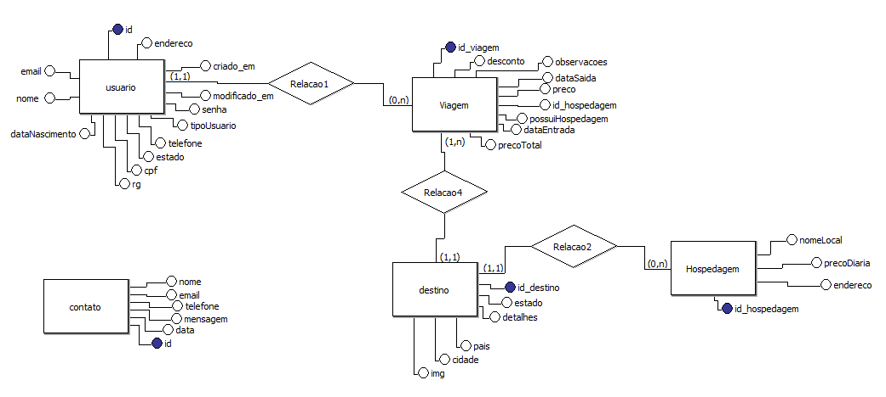
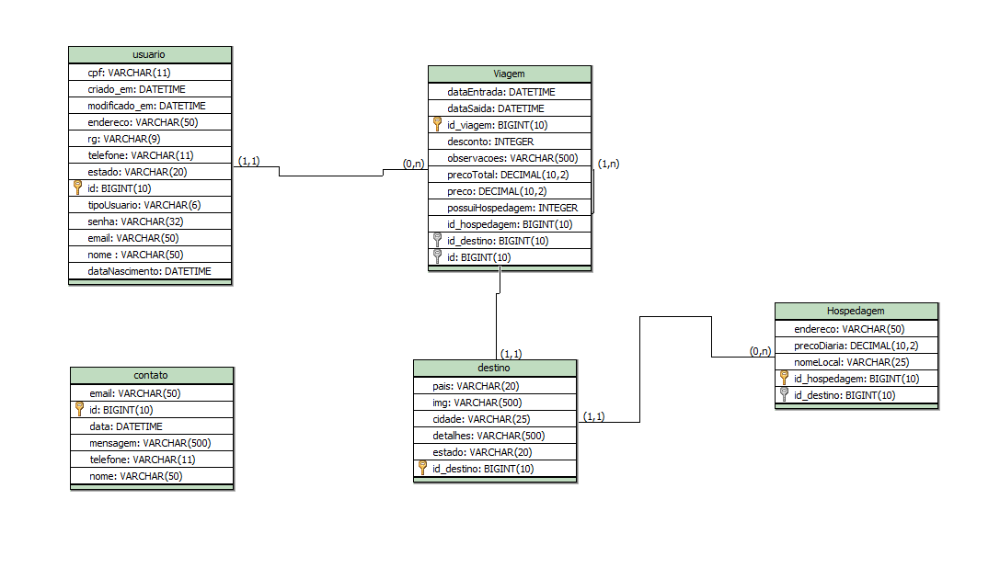

# Agência de viagens - Backend + dados

Esse desafio consiste na entrega da atividade individual do módulo 2, 
aonde continua a criação da nossa aplicação da agência de viagens 
criando agora uma aplicação backend com java e banco de dados MySQL utilizando 
seus relacionamentos e cardinalidades, no java utilizando console para interação com a aplicação.

## Modelagem de dados

1. Modelagem Conceitual

2. Modelo Lógico
   

3. Modelo fisico
- Na pasta modelagem_dados com o nome valonge.sql;

## UML de classe JAVA    

## Backend Java
 * Criação de um menu intuitivo para interação com o CRUD da aplicação.
 * Usando JDBC e MySQL.
   
## Utilização
1. Clone o repositório para o seu ambiente local.
~~~
git clone https://github.com/MaiconNunes315/V-longe-dados
~~~

* Necessário a importação do conector MySQL para correto funcionamento da aplicação.
 
