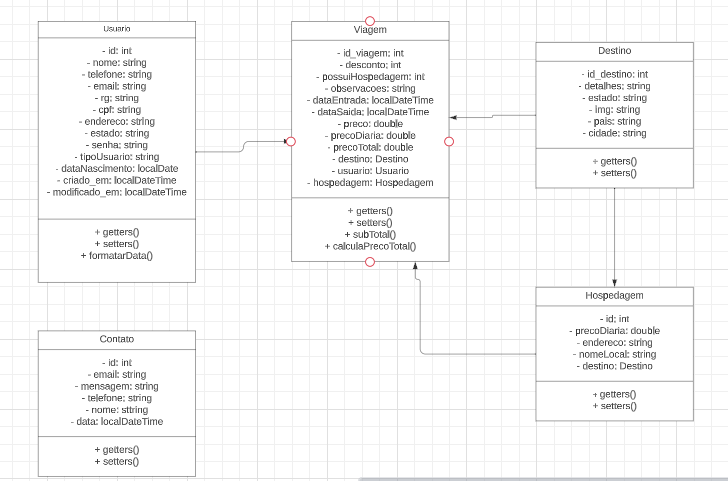

# Agência de viagens

Primeiro diretório é uma simulação de um menu em pseudocódigo para uma agência de viagens, que permite o cadastro de clientes e destinos. Também são fornecidas opções para consultar as estruturas de dados utilizadas.

Segundo diretório é uma página web criada apenas com HTML, CSS e Bootstrap com as páginas Home, Destino, Promoções, Contato, elas são responsivas e adaptáveis.

## Pseudocódigo

1. Pseudocódigo criado em [Portugol](https://portugol-webstudio.dgadelha.xyz/ide)
2. Um menu simples com as opções de: 
    - Criar cadastro de cliente e destino;
    - Consultar os dados de clientes e destinos cadastrado;

## Página web

1. Na página principal foi criado:
- Um banner como se fosse uma propagranda do web site;
- Um container de cards a respeito das promoções;
- Um container de cards a respeitos dos destinos.

2. Na página de promoções foi criado:
   - Um carrosel com as principais promoções;
   - Um container de cards com as promoções.
   

3. Na página de destinos foi criado:
- Cards com destinos nacionais;
- Cards com destinos internacionais.

  

## Recursos
 * Interface intuitiva e amigável.
 * Navegação por páginas pelo cabeçalho e pelo rodapé.

## Modelagem de dados

## UML de classes

## Backend Java
 * Criação de um menu intuitivo para interação com o CRUD da aplicação.
 * Usando JDBC e MySQL.
## Utilização
1. Clone o repositório para o seu ambiente local.

~~~
git clone https://github.com/MaiconNunes315/1-Entrega_recode
~~~ 

5. Acesse a aplicação no seu navegador [clicando aqui](https://1-entrega-recode.vercel.app/)

Tecnologias Utilizadas
 * HTML
 * CSS
 * Bootstrap
 
